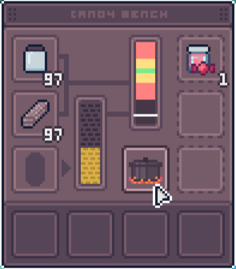

candy - A candymaking mod for [APICO](https://apico.buzz/)
----------------------------------------------------------

This mod adds a new workshop item, the Candy Bench, which can produce Apicandy of various qualities.

When you have all the inputs, hit the button to cook up some candy, and hit it again to stop. Get the line inside the green area for best results.

Here is the bench and GUI: 

Created by [Maren Pan](https://twitter.com/paarsec) and [Sy Brand](https://twitter.com/tartanllama).

